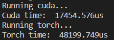

# cuda_self_attention
cuda实现的self attention算子

cuda版本：10.2

显卡：NVIDIA GeForce RTX 2060

pytorch版本：1.9.0

## 实现

cuda中实现了多个核函数，具体如下：

### MatrixMulKernel

矩阵乘法核函数，使用CSE599W第五节所讲的GEMM算法

### MatrixTKernel

矩阵转置核函数

### ReduceMaxKernel

求行的最大值核函数，使用规约的方法实现（类似于倍增的思想）

### BroadCastSubExpKernel

广播进行减操作和幂操作的核函数

### ReduceSumKernel

求行的和核函数，使用规约的方法实现（类似于倍增的思想）

### DivKernel

广播进行除操作的核函数

灵活组合使用上面的核函数即可实现self attention

实际测试中，在输入维度为(500,1500)，输出维度为(500,800)的情况下，和使用pytorch实现的self attention比较，使用运行十次取平均值的方法，执行时间对比如下：

（过大的数据显卡内存跑不下）

可以看到在数据较小的情况下，算法的性能是优于torch实现的算子的

## TODO

算子的自动求导

batch的boradcast核函数的实现

## 感想

感觉实现的过程有点像CSE599W作业2写TVM的流程，但是写cuda要比tvm要复杂一些，涉及一些并行的算法

